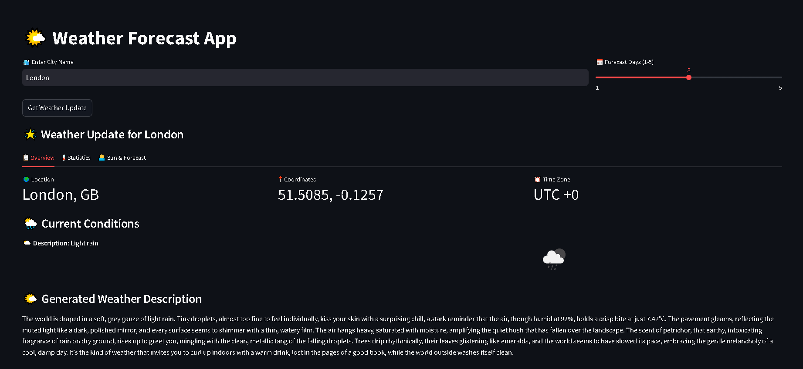
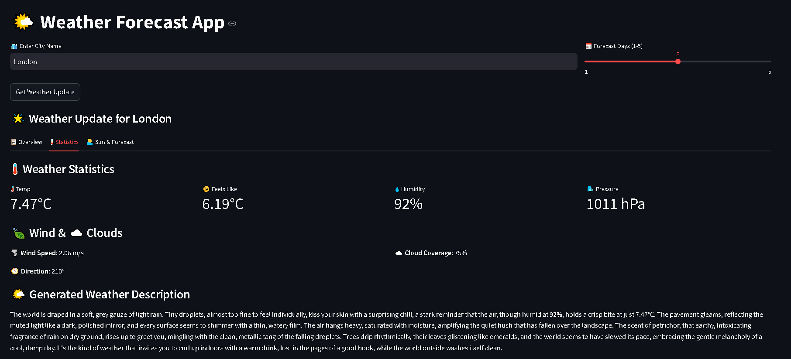
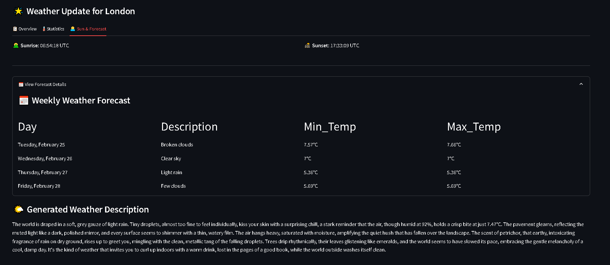

# WeatherSmartAI





## Overview

Welcome to the **Weather Forecast App**, a dynamic and user-friendly web application built using **Streamlit** and **Google Generative AI** to provide real-time weather updates and personalized weather descriptions. The app integrates **OpenWeatherMap API** to fetch weather data and **Gemini AI** to generate creative and engaging weather summaries. With an intuitive interface, users can get detailed current weather data, forecasts, and AI-generated descriptions, all presented in a visually appealing manner.

---

## Key Features

- **Real-time Weather Updates**: Get accurate and up-to-date weather information for any city worldwide, including temperature, humidity, wind speed, and more.
- **Forecasting**: View up to a 7-day weather forecast with detailed daily summaries.
- **AI-Generated Descriptions**: Leverage the power of **Google's Gemini AI** to generate creative, engaging weather descriptions.
- **User-Friendly Interface**: A simple, intuitive interface built with **Streamlit** allows easy navigation and quick access to weather details.
- **Lottie Animations**: Interactive Lottie animations enhance user experience and make the weather updates visually appealing.
- **Detailed Weather Stats**: View important weather statistics like temperature, pressure, wind speed, and more in an easy-to-read format.

---

## Getting Started

### Prerequisites

Before running the app, ensure you have the following dependencies installed:

- **Streamlit**: For building the interactive web application.
- **python-dotenv**: For managing environment variables.
- **requests**: To make API calls for weather data.
- **google-generativeai**: To integrate Google's Gemini AI for text generation.
- **pytz**: For time zone handling.
- **streamlit-lottie**: For embedding Lottie animations.

## Installation

Clone this repository:
   ```bash
   git clone https://github.com/PriyanshuDey23/WeatherSmartAI.git
   ```

Install the necessary dependencies:
   ```bash
   pip install -r requirements.txt
   ```


### Setting Up API Keys

To access the weather data and Google Gemini AI, you'll need to set up the following API keys:

1. **Google API Key**: Sign up for Google's Generative AI API [here](https://aistudio.google.com/apikey) and obtain your API key.
2. **OpenWeatherMap API Key**: Register on the [OpenWeatherMap website](https://home.openweathermap.org/api_keys) to obtain your API key for accessing weather data.

Store your API keys in a `.env` file in the root directory of your project:

```bash
GOOGLE_API_KEY=your_google_api_key
WEATHER_API_KEY=your_openweathermap_api_key
```

---

## Features Breakdown

### Weather Data Retrieval

- **`get_weather_data(city)`**: Fetches the current weather data for the specified city using OpenWeatherMap API.
- **`user_forecast(lat, lon, forecast_days)`**: Retrieves a weather forecast for the next few days based on the city’s latitude and longitude.
- **`generate_weather_description(weather_data)`**: Generates a creative and engaging weather description using the **Google Gemini AI**.

### User Interface

- **City Input**: Users can enter any city name to get real-time weather updates.
- **Forecast Days**: Allows users to choose the number of days they wish to see the weather forecast for.
- **Metrics Display**: Displays key metrics such as temperature, humidity, wind speed, and more in a visually appealing format.
- **Sunrise/Sunset Times**: Displays accurate sunrise and sunset times based on the city’s location.
- **Lottie Animations**: Adds a fun and interactive element to the UI using Lottie animations.

### Error Handling

The app includes error handling to ensure a seamless user experience:

- Displays an error message if API keys are missing or invalid.
- Handles network issues and displays appropriate error messages when weather data cannot be fetched.

---

## Running the App

To start the app, use the following command in your terminal:

```bash
streamlit run app.py
```

This will launch the application in your default web browser. You can then enter a city name and get a weather update along with a personalized description generated by Gemini AI.

---

## Conclusion

The **Weather Forecast App** is a unique and creative solution for anyone looking to stay updated on the weather while enjoying engaging, AI-generated descriptions. By combining **Google Generative AI** and **OpenWeatherMap API**, this app provides users with accurate data, personalized summaries, and an interactive user experience.

We hope you enjoy using the app and find it both functional and fun!

---

## Contributing

Feel free to fork this repository, submit issues, and contribute improvements. Pull requests are welcome!

---

## License

This project is licensed under the MIT License - see the [LICENSE](LICENSE) file for details.
